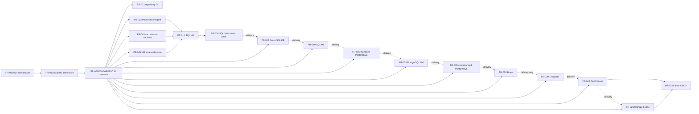

# Feature Requests

This catalog records Azure Data Lab Toolkit feature epics. It is a roadmap, not
a statement of shipped behavior or a delivery commitment.

`Depends on` lists direct technical prerequisites. `Scheduled after` records
delivery order and does not create architectural coupling. The authoritative
segment outcomes and exit gates are in
[`architecture/delivery-segments.md`](architecture/delivery-segments.md).

Maturity terms follow the project vocabulary: **Committed design** is accepted
architecture that is not implemented; **Backlog** is intended work whose
contract is not settled; **Exploratory** is research or unresolved design;
**Deferred** is explicitly postponed. **Available** is reserved for released and
verified functionality. No epic in this catalog is Available.

Implementation is tracked in [GitHub issues](https://github.com/kaysauter/Azure-Data-Lab-Toolkit/issues)
and on the public [Azure Data Lab Toolkit Roadmap](https://github.com/users/kaysauter/projects/6/views/1).
The `FR-###` identifiers are stable across this catalog, issue titles, and
Project fields.

## Delivery Spine

Solid arrows show the main technical contract path. Dashed arrows show scheduled
delivery focus only; they are not code dependencies.

Assessment in FR-007 is a release requirement where applicable. It is not a
technical prerequisite for security, planning, cost, or initial deployment.
Bicep and Terraform share contracts but do not technically depend on each other.

## Backlog

| ID | Feature request | Intended outcome | Phase | Priority | Depends on | Scheduled after | Segment | Maturity |
| --- | --- | --- | --- | --- | --- | --- | --- | --- |
| FR-001 | Architecture baseline and decision governance | Govern the seven-part architecture, status vocabulary, delivery segments, plan and state contracts, and architecture decisions. | Foundation | P0 | None | None | S0 | Committed design |
| FR-002 | AzureDataLabToolkit module and public API | Deliver an installable PowerShell module, stable cmdlet surface, packaging policy, and new name without legacy aliases. | Foundation | P0 | FR-001 | None | S1 | Backlog |
| FR-003 | Versioned YAML configuration and CLI overrides | Make schema-validated YAML canonical while defining defaults, template and flag precedence, engine selection, and explicit risky-action opt-ins. | Foundation | P0 | FR-001, FR-002 | None | S1 | Backlog |
| FR-004 | Core and extension contracts | Standardize normalized actions and separate contracts for Core, target providers, capability modules, catalog sources, solution packs, probes, and deployment engines. | Foundation | P0 | FR-001, FR-002 | None | S0 | Committed design |
| FR-005 | Engine-neutral planning | Implement offline `-Plan` with deterministic provenance, resources, actions, `secretStoreDecision`, VM access decisions, cost intent, licensing, data, ownership, and teardown intent. | Foundation | P0 | FR-003, FR-004 | None | S1 | Backlog |
| FR-006 | Local run state, retries, and audit trail | Persist immutable run IDs, plans, append-only events, snapshots, local locking, failures, evidence, cleanup state, and safe interactive resume without storing secrets. | Foundation | P0 | FR-005 | None | S1 | Backlog |
| FR-007 | Assessment and decision reporting | Provide distinct security, compatibility, and migration-readiness assessments using Azure Arc and the migration component in SQL Server Management Studio first, with console, Markdown, JSON, and HTML output. | SQL VM | P1 | FR-005, FR-006, FR-034 | None | S6 | Backlog |
| FR-008 | Security, identity, and network policy | Implement policy decisions for least privilege, managed identity, private access, secret references, sensitive-data acknowledgement, public exceptions, and explicit approvals. | Foundation | P0 | FR-003, FR-004, FR-005 | None | S1 | Backlog |
| FR-009 | Cost and lifecycle guardrails | Add YAML-driven cost estimation, HTML output, price provenance and unknowns, budgets, TTL, shutdown, preauthorized auto-teardown, deletion confirmation, and post-teardown billing evidence. | Foundation | P0 | FR-005, FR-006, FR-008 | None | S1 | Backlog |
| FR-010 | Secure templates and optional terminal UI | Provide scenario templates and an optional TUI that generate the same validated YAML while retaining complete flag and API access. | Foundation | P1 | FR-003, FR-005, FR-008, FR-009 | None | S1 | Backlog |
| FR-011 | Governed catalogs and licensing | Catalog samples, tools, artifacts, templates, and sources with ownership, licensing, attribution, exact versions, integrity, compatibility, privilege, and warnings. | Foundation | P0 | FR-003, FR-004, FR-005, FR-008 | None | S1 | Backlog |
| FR-012 | Toolkit repository CI and vulnerability gates | Establish the toolkit repository's GitHub Actions checks for packaging, Pester, schemas, docs, dependencies, secrets, static analysis, vulnerabilities, and signed releases without conflating them with user-facing lab pipelines. | Engineering | P0 | FR-002, FR-003, FR-004 | None | S2 | Backlog |
| FR-013 | Deployment validation and WhatIf framework | Build provider-independent fixtures, Azure-aware non-mutating `-WhatIf`, negative-path, drift, cost, TTL, cleanup-proof, and failure-handoff contracts; each provider owns its live lanes. | Foundation | P0 | FR-004, FR-005, FR-006, FR-008, FR-009 | None | S1 | Backlog |
| FR-014 | SQL Server on Azure VM target provider | Build the first Windows SQL VM provider with private access, stable capabilities, guest and SQL boundaries, PowerShell execution, probes, state, and teardown while requesting Key Vault and Bastion capabilities rather than embedding them. | SQL VM | P0 | FR-005, FR-008, FR-009, FR-013, FR-033, FR-034, FR-035, FR-043, FR-044 | None | S4 | Backlog |
| FR-015 | Storage and backup-staging capability module | Provision or reuse ADLS Gen2, Blob Storage, and Azure Files for backups, files, shared staging, and optional VM network-drive mounting through reusable capability contracts. | Data and Artifacts | P1 | FR-004, FR-005, FR-008, FR-009, FR-034 | None | S5 | Backlog |
| FR-016 | Sample, community, and private data onboarding | Acquire, validate, stage, and load Microsoft, community, generated, local, URL-hosted, or private data with licensing, integrity, sensitivity, and removal evidence independent of one target provider. | Data and Artifacts | P1 | FR-004, FR-005, FR-011, FR-015, FR-034 | None | S5 | Backlog |
| FR-017 | Software and custom artifact delivery | Resolve and deliver approved community tools and user artifacts from packages, local paths, or URLs with exact-version resolution, checksum or signature policy, privilege declaration, verification, and removal evidence. | Data and Artifacts | P1 | FR-004, FR-005, FR-011, FR-034 | None | S5 | Backlog |
| FR-018 | Azure SQL Database target provider | Create or reuse Azure SQL databases with Entra identity, private networking, explicit secret-store decisions, cost and lifecycle evidence, probes, and optional data-onboarding adapters. | Azure SQL | P1 | FR-005, FR-008, FR-009, FR-013, FR-033, FR-034, FR-037, FR-043 | S6 release gate | S7 | Backlog |
| FR-019 | Azure SQL Managed Instance target provider | Provide private SQL MI labs with subnet, DNS, quota, region, deployment-time, restore, cost, secret-store, probe, recovery, and cleanup evidence. | Azure SQL | P1 | FR-005, FR-008, FR-009, FR-013, FR-015, FR-033, FR-034, FR-037, FR-043 | FR-018 | S8 | Backlog |
| FR-020 | Fabric choices, prerequisites, and workspaces | Guide SQL database versus Warehouse versus Lakehouse choices and validate or create permitted capacities and workspaces with explicit secret-store, role, cost, and lifecycle decisions. | Fabric | P1 | FR-005, FR-008, FR-009, FR-011, FR-013, FR-033, FR-034, FR-037, FR-043 | S14 release gate | S15 | Backlog |
| FR-021 | Fabric item lifecycle | Plan, deploy, and probe supported Fabric databases, warehouses, lakehouses, notebooks, environments, pipelines, dataflows, semantic models, reports, and Eventhouses through a versioned support matrix. | Fabric | P1 | FR-020, FR-034, FR-043 | None | S16 | Backlog |
| FR-022 | Fabric shortcuts and data connectivity | Create and validate OneLake shortcuts while explaining data location, identity, ownership, freshness, caching, failure, and delete behavior. | Fabric | P1 | FR-015, FR-020, FR-021, FR-034, FR-043 | None | S16 | Backlog |
| FR-023 | Fabric CI/CD | Research and implement only supported Fabric Git integration, staged workspaces, deployment pipelines, Items APIs, variable libraries, approvals, and metadata-versus-data validation without claiming complete IaC parity. | Fabric | P1 | FR-021, FR-042 | FR-022 | S17 | Exploratory |
| FR-024 | FUAM, Rayfin, and TMDL solution packs | Track FUAM, Rayfin, and TMDL as separate sub-issues with pack-specific prerequisites, secret-store decisions, validation, user-confirmed changes, probes, recovery, and teardown. | Fabric | P2 | FR-020, FR-021, FR-034, FR-043 | Required S16 item children | S18 | Backlog |
| FR-025 | Azure Database for PostgreSQL target provider | Support PostgreSQL Flexible Server with private access, supported Entra or PostgreSQL authentication, explicit secret-store decisions, compatibility evidence, probes, and dump or restore paths. | PostgreSQL | P1 | FR-005, FR-008, FR-009, FR-013, FR-033, FR-034, FR-037, FR-043 | FR-019 | S9 | Backlog |
| FR-026 | Azure Databricks target provider | Validate or create governed Databricks labs with Unity Catalog, ADLS Gen2, notebooks, compute guidance, secret-store decisions, cost controls, probes, and cleanup evidence. | Ecosystem | P2 | FR-005, FR-008, FR-009, FR-013, FR-015, FR-033, FR-034, FR-037, FR-043 | S18 release gate | S19 | Backlog |
| FR-027 | Additional Git and pipeline adapters | Implement Azure DevOps, GitLab, Gitea, and Forgejo adapters against the common Git and CI/CD intent contract; treat optional hosted Gitea or Forgejo labs as separate solution-pack work. | Git and CI/CD | P1 | FR-004, FR-005, FR-042 | FR-029 | S14 | Backlog |
| FR-028 | Bicep deployment engine | Translate supported normalized plans into deterministic Bicep with build, Azure what-if evidence, apply, partial-failure, stable-ID, and teardown conformance while retaining toolkit orchestration. | Engines | P1 | FR-004, FR-005, FR-006, FR-008, FR-009, FR-013, FR-014, FR-018, FR-034, FR-037 | FR-039 | S12 | Backlog |
| FR-029 | Terraform deployment engine | Translate supported normalized plans into Terraform with formatting, validation, saved-plan evidence, secure remote state, import boundaries, drift, apply, destroy, stable-ID, and teardown conformance. | Engines | P1 | FR-004, FR-005, FR-006, FR-008, FR-009, FR-013, FR-014, FR-018, FR-034, FR-037 | FR-028 | S13 | Backlog |
| FR-030 | SQL Server on Linux and containers | Add separately gated SQL Server Linux VM and container variants using shared Linux guest and container-runtime capabilities with equivalent licensing, data, tools, probes, secret-store, VM access, cost, and lifecycle evidence. | Later Platforms | P2 | FR-005, FR-008, FR-009, FR-013, FR-033, FR-034, FR-037, FR-040, FR-041, FR-043 | S20 release gate | S21 | Backlog |
| FR-031 | Kubernetes targets | Add explicitly supported AKS or Kubernetes scenarios after a required container workload has passed release, including workload identity, isolation, storage, secrets, cost, upgrades, probes, and cleanup validation. | Later Platforms | P3 | FR-008, FR-009, FR-013, FR-034, FR-037, FR-039, FR-041, FR-043 | FR-030 | S22 | Deferred |
| FR-032 | Later data target portfolio | Split Cosmos DB, Azure Data Explorer, Event Hubs, MySQL, MariaDB, streaming, and other justified platforms into separate provider child epics with their own architecture decision and release gate. | Future | P3 | FR-005, FR-008, FR-009, FR-011, FR-013, FR-034, FR-037, FR-043 | FR-026 | S20 | Deferred |
| FR-033 | PowerShell deployment engine | Export and apply approved plan actions through PowerShell with deterministic artifacts, stable IDs, structured errors, idempotency, partial-failure evidence, and capability-based refusal. | Engines | P0 | FR-004, FR-005, FR-006, FR-008, FR-013 | None | S1 | Backlog |
| FR-034 | Probe and evidence framework | Define versioned probe contracts and one evidence envelope for Plan, WhatIf, cost, deployment, assessment, security, target checks, teardown, and cleanup renderable as console, JSON, Markdown, or HTML. | Foundation | P0 | FR-004, FR-005, FR-006 | None | S1 | Backlog |
| FR-035 | Windows guest-operations capability | Perform narrowly scoped Windows bootstrap and configuration with least privilege, explicit SYSTEM boundaries, no database or user secrets in SYSTEM context, idempotency, and postcondition evidence. | VM Capabilities | P0 | FR-004, FR-005, FR-008, FR-034, FR-043 | S3 contract gate | S4 | Backlog |
| FR-036 | SQL VM solution pack | Compose the SQL VM provider, storage, governed data, approved software, guest operations, probes, Key Vault, and Bastion decisions into the first useful repeatable lab. | SQL VM | P0 | FR-014, FR-015, FR-016, FR-017, FR-034, FR-035, FR-043, FR-044 | FR-035 | S5 | Backlog |
| FR-037 | Remote state and execution coordination | Add Azure Blob-backed or equivalent remote state with encryption, managed identity or OIDC, leases, fencing, idempotency, resumable handoffs, retention, and duplicate-trigger protection for CI, webhooks, and unattended mutation. | Foundation | P0 | FR-005, FR-006, FR-008, FR-034 | S3 contract gate | S6 | Backlog |
| FR-038 | PostgreSQL on Azure VM target provider | Deliver native PostgreSQL on a private Linux Azure VM through Linux guest capabilities, with secret-store and Bastion-first access decisions, data paths, probes, patch evidence, cost, and cleanup. | PostgreSQL | P1 | FR-005, FR-008, FR-009, FR-013, FR-033, FR-034, FR-037, FR-040, FR-043, FR-044 | FR-025 | S10 | Backlog |
| FR-039 | Containerized PostgreSQL target provider | Deliver PostgreSQL through explicitly supported container-host adapters with image provenance, persistence, secret-store decisions, backup or restore, probes, upgrades, cost, and cleanup; activate Linux guest and Bastion capabilities when VM-hosted. | PostgreSQL | P1 | FR-005, FR-008, FR-009, FR-013, FR-033, FR-034, FR-037, FR-041, FR-043 | FR-038 | S11 | Backlog |
| FR-040 | Linux guest-operations capability | Provide distro-declared, least-privilege Linux package, service, file, patch, and command operations with idempotency, artifact verification, redaction, and postcondition evidence. | VM Capabilities | P1 | FR-004, FR-005, FR-008, FR-034, FR-043 | FR-035 | S10 | Backlog |
| FR-041 | Container-runtime capability | Provide reusable image, registry, network, volume, secret-reference, health, update, replacement, and cleanup behavior for declared Docker or managed-container hosts. | Container Capabilities | P1 | FR-004, FR-005, FR-008, FR-009, FR-034, FR-043 | FR-040 | S11 | Backlog |
| FR-042 | Git and CI/CD intent contract with GitHub reference adapter | Model validate, plan, approve, deploy, probe, report, and teardown intent across pipeline systems and deliver GitHub repository and Actions templates using OIDC, remote state, protected environments, and retained evidence. | Git and CI/CD | P1 | FR-004, FR-005, FR-006, FR-008, FR-013, FR-034, FR-037 | FR-029 | S14 | Backlog |
| FR-043 | Secret-store decision and Key Vault capability | Require every target and solution pack to emit `deploy-key-vault`, `reuse-key-vault`, `approved-external-store`, or justified `not-applicable`, and implement Azure Key Vault as a reusable capability with references only. | Security Capabilities | P0 | FR-003, FR-004, FR-005, FR-008, FR-009, FR-034 | None | S3 | Committed design |
| FR-044 | VM administrative access and Bastion capability | Require every Azure VM to emit an `administrativeAccessDecision`, default to Bastion with no public IP, and make reuse or opt-out explicit, approved, costed, and evidenced through a reusable capability. | Security Capabilities | P0 | FR-003, FR-004, FR-005, FR-008, FR-009, FR-034 | None | S3 | Committed design |

## Shared Definition Of Done

Each implemented epic must include:

- focused Pester, contract, and relevant integration evidence;
- the Contract, Live, or Release evidence required by its assigned segment;
- security, identity, network, cost, licensing, and data-sensitivity review where
  applicable;
- explicit `secretStoreDecision` for every target and solution pack;
- explicit `administrativeAccessDecision` for every Azure VM;
- plan, run-state, retry, probe, ownership, and teardown behavior where
  applicable;
- user documentation that distinguishes shipped behavior from roadmap behavior;
- no unreviewed secrets, credentials, private data, or third-party
  redistribution.

## External Prerequisites

Some epics also depend on external readiness that cannot be represented as code
dependencies:

- isolated Azure test subscriptions with suitable quotas and ownership;
- Entra ID, Key Vault, Bastion, and GitHub OIDC permissions;
- GitHub security and Project features available to the repository;
- remote-state storage and retention policy for unattended mutation;
- Microsoft Fabric tenant settings, capacity, and licensing;
- approved handling rules for real or sensitive test data;
- redistribution permission for third-party samples and tools.
