# Feature Requests

This catalog records Azure Data Lab Toolkit feature epics. It is a roadmap, not a statement of shipped behavior or a delivery commitment.

`Depends on` lists direct technical prerequisites. `Scheduled after` records delivery order and does not create architectural coupling. An epic can move toward implementation when its prerequisites are complete, external requirements are available, and the delivery sequence permits it.

Status terms follow the project vocabulary: **Committed design** is accepted architecture that is not implemented; **Backlog** is intended work whose contract is not settled; **Exploratory** is research or unresolved design; **Deferred** is explicitly postponed. **Available** is reserved for released and verified functionality. No epic in this catalog is Available.

Implementation is tracked in [GitHub issues](https://github.com/kaysauter/Azure-Data-Lab-Toolkit/issues) and on the public [Azure Data Lab Toolkit Roadmap](https://github.com/users/kaysauter/projects/6/views/1). The `FR-###` identifiers are stable across this catalog, issue titles, and Project fields.

## Critical Paths

The table below is authoritative. Solid arrows in the diagram are technical prerequisites. Dashed arrows show delivery sequence only.

```mermaid
flowchart LR
  FR001["FR-001 Architecture"] --> FR002["FR-002 Module"]
  FR002 --> FR003["FR-003 YAML and flags"]
  FR001 --> FR004["FR-004 Provider contracts"]
  FR003 --> FR005["FR-005 Planning"]
  FR004 --> FR005
  FR005 --> FR006["FR-006 Run state"]
  FR006 --> FR007["FR-007 Assessment"]
  FR007 --> FR008["FR-008 Security"]
  FR008 --> FR009["FR-009 Cost and lifecycle"]
  FR002 --> FR012["FR-012 GitHub CI/CD"]
  FR004 --> FR012
  FR009 --> FR013["FR-013 Validation framework"]
  FR012 --> FR013
  FR013 --> FR014["FR-014 Azure SQL VM"]
  FR014 --> FR015["FR-015 Storage"]
  FR015 --> FR016["FR-016 Data onboarding"]
  FR013 --> FR018["FR-018 Azure SQL DB"]
  FR013 --> FR019["FR-019 SQL MI"]
  FR013 --> FR020["FR-020 Fabric choices"]
  FR020 --> FR021["FR-021 Fabric items"]
  FR021 --> FR023["FR-023 Fabric CI/CD"]
  FR023 --> FR024["FR-024 FUAM, Rayfin, TMDL"]
  FR013 --> FR025["FR-025 PostgreSQL"]
  FR025 --> FR030["FR-030 Linux and containers"]
  FR030 --> FR031["FR-031 Kubernetes"]
  FR014 --> FR028["FR-028 Bicep"]
  FR014 --> FR029["FR-029 Terraform"]

  FR014 -.->|target order| FR018
  FR018 -.->|target order| FR019
  FR019 -.->|target order| FR020
  FR021 -.->|target order| FR025
  FR028 -.->|engine delivery order| FR029
```

## Backlog

| ID | Feature request | Intended outcome | Phase | Priority | Depends on | Scheduled after | Status |
| --- | --- | --- | --- | --- | --- | --- | --- |
| FR-001 | Architecture baseline and decision governance | Finalize product boundaries, status vocabulary, extension types, target order, plan and state contracts, and architectural decision records. | Foundation | P0 | None | None | Committed design |
| FR-002 | AzureDataLabToolkit module and public API | Establish the installable PowerShell module, stable cmdlet surface, packaging policy, and new name without legacy aliases. | Foundation | P0 | FR-001 | None | Backlog |
| FR-003 | Versioned YAML configuration and CLI overrides | Make schema-validated YAML canonical while defining defaults, flag precedence, engine selection, and explicit risky-action opt-ins. | Foundation | P0 | FR-001, FR-002 | None | Backlog |
| FR-004 | Core and extension contracts | Standardize normalized actions plus separate contracts for target providers, capability modules, catalog sources, solution packs, deployment engines, and probes. | Foundation | P0 | FR-001, FR-002 | None | Backlog |
| FR-005 | Engine-neutral planning | Implement offline `-Plan` with deterministic values, sources, resources, actions, security, cost, licensing, data, and teardown decisions. | Foundation | P0 | FR-003, FR-004 | None | Backlog |
| FR-006 | Run state, retries, and audit trail | Persist run IDs, plans, resources, logs, failures, cleanup state, durable agent handoffs, and externally triggered continuation for retries, drift detection, and teardown. | Foundation | P0 | FR-005 | None | Backlog |
| FR-007 | Assessment and decision reporting | Provide distinct security, compatibility, and migration-readiness assessments using Azure Arc and the migration component in SQL Server Management Studio first, with console, Markdown, JSON, and HTML output. | Foundation | P0 | FR-005, FR-006 | None | Backlog |
| FR-008 | Security, identity, and network guardrails | Enforce managed identity, Key Vault RBAC, private networking, Bastion guidance, secret-output opt-ins, and sensitive-data acknowledgement. | Foundation | P0 | FR-003, FR-004, FR-007 | None | Backlog |
| FR-009 | Cost and lifecycle guardrails | Add YAML-driven cost estimation, HTML output, budgets, TTL, shutdown, auto-teardown, deletion confirmation, and post-teardown proof. | Foundation | P0 | FR-005, FR-006, FR-007, FR-008 | None | Backlog |
| FR-010 | Secure templates and optional terminal UI | Provide scenario templates and an optional TUI that generate the same validated YAML while retaining complete flag and API access. | Foundation | P1 | FR-003, FR-007, FR-008, FR-009 | None | Backlog |
| FR-011 | Governed catalogs and licensing | Catalog samples, tools, artifacts, templates, and sources with ownership, licensing, attribution, versions, checksums, compatibility, and warnings. | Foundation | P0 | FR-003, FR-007, FR-008 | None | Backlog |
| FR-012 | GitHub CI/CD, repository automation, and vulnerability gates | Establish GitHub Actions, OIDC, protected environments, reusable workflows, config/report artifacts, issue and PR automation, review handoffs, webhooks, and layered security scans. | Foundation | P0 | FR-002, FR-003, FR-004 | None | Backlog |
| FR-013 | Deployment validation and WhatIf framework | Build provider-independent fixtures, matrices, Azure-aware non-mutating `-WhatIf`, TTL, cost, cleanup-proof, and durable failure-handoff contracts; each target provider owns its live smoke and nightly lanes. | Foundation | P0 | FR-005, FR-006, FR-008, FR-009, FR-012 | None | Backlog |
| FR-014 | SQL Server on Azure VM target provider | Build the first Windows SQL VM reference provider with Bastion, Key Vault, private access, guest setup, restore support, and a live deployment/probe/teardown lane. Apply predecessor lessons without assuming a working capability exists. | SQL VM | P0 | FR-007, FR-008, FR-009, FR-013 | None | Backlog |
| FR-015 | Storage and backup-staging capability module | Provision or reuse ADLS Gen2, Blob Storage, and Azure Files for backups, files, shared staging, and VM network-drive mounting. | SQL VM | P1 | FR-013, FR-014 | None | Backlog |
| FR-016 | Sample, community, and private data onboarding | Acquire, validate, and load Microsoft, community, generated, local, URL-hosted, or private data with licensing and sensitivity controls. | SQL VM | P1 | FR-011, FR-014, FR-015 | None | Backlog |
| FR-017 | Software and custom artifact delivery | Install approved community tools and user artifacts from packages, local paths, or URLs with pinning, checksum, signature, and override policies. | SQL VM | P1 | FR-011, FR-014, FR-015 | None | Backlog |
| FR-018 | Azure SQL Database target provider | Create or reuse Azure SQL databases with Entra, networking, assessment, and sample-load support. | Azure SQL | P1 | FR-013, FR-016 | FR-014 | Backlog |
| FR-019 | Azure SQL Managed Instance target provider | Provide private SQL MI labs with subnet, DNS, quota, region, cost, deployment-time, assessment, restore, and migration validation. | Azure SQL | P1 | FR-013, FR-015, FR-016 | FR-018 | Backlog |
| FR-020 | Fabric choices, prerequisites, and workspaces | Guide SQL database versus Warehouse versus Lakehouse choices and validate or create capacities and workspaces where permitted. | Fabric | P1 | FR-011, FR-013 | FR-019 | Backlog |
| FR-021 | Fabric item lifecycle | Plan, deploy, and probe Fabric databases, warehouses, lakehouses, notebooks, environments, pipelines, dataflows, semantic models, reports, and Eventhouses. | Fabric | P1 | FR-020 | None | Backlog |
| FR-022 | Fabric shortcuts and data connectivity | Create and validate OneLake shortcuts while explaining security, ownership, freshness, caching, and delete behavior. | Fabric | P1 | FR-015, FR-020, FR-021 | None | Backlog |
| FR-023 | Fabric CI/CD | Research and implement supported Git integration, staged workspaces, deployment pipelines, Items APIs, variable libraries, and metadata-versus-data validation without assuming complete IaC coverage. | Fabric | P1 | FR-012, FR-020, FR-021 | None | Exploratory |
| FR-024 | FUAM, Rayfin, and TMDL solution packs | Offer FUAM validation with user-confirmed setup or repair guidance plus reproducible Rayfin and TMDL demonstrations. | Fabric | P2 | FR-021, FR-023 | None | Backlog |
| FR-025 | PostgreSQL target provider | Support Azure Database for PostgreSQL Flexible Server first with private access, Entra options, compatibility assessment, probes, and dump/restore paths. | PostgreSQL | P1 | FR-013, FR-015, FR-016 | FR-021 | Backlog |
| FR-026 | Azure Databricks target provider | Validate or create Databricks labs with Unity Catalog, ADLS Gen2, notebooks, compute guidance, cost controls, and CI/CD guidance. | Ecosystem | P2 | FR-011, FR-013, FR-015 | FR-025 | Backlog |
| FR-027 | Additional Git capability modules | Extend Git integration to Azure DevOps, GitLab, Gitea, and Forgejo, including optional lab-hosted Gitea or Forgejo environments. | Ecosystem | P2 | FR-004, FR-005, FR-012 | None | Backlog |
| FR-028 | Bicep deployment engine | Translate normalized plans into Bicep with build, what-if, and deployment-stack lifecycle support while retaining PowerShell orchestration. | Engines and Platforms | P2 | FR-005, FR-006, FR-009, FR-013, FR-014 | FR-014 | Deferred |
| FR-029 | Terraform deployment engine | Translate normalized plans into Terraform with secure state, formatting, validation, planning, drift, and lifecycle guidance while retaining PowerShell orchestration. | Engines and Platforms | P2 | FR-005, FR-006, FR-009, FR-013, FR-014 | FR-028 | Deferred |
| FR-030 | Linux VM and container targets | Add SQL Server and PostgreSQL on Linux VMs, Docker, Azure Container Instances, and Azure Container Apps with equivalent data, tools, probes, security, and lifecycle behavior. | Engines and Platforms | P2 | FR-013, FR-014, FR-015, FR-016, FR-017, FR-025 | FR-025 | Backlog |
| FR-031 | Kubernetes targets | Add AKS and Kubernetes scenarios after container contracts mature, including isolation, storage, secrets, cost, and cleanup validation. | Engines and Platforms | P3 | FR-008, FR-009, FR-013, FR-030 | FR-030 | Deferred |
| FR-032 | Later data targets | Extend the target and adapter model to MySQL/MariaDB, Azure Data Explorer, Cosmos DB, Event Hubs, streaming scenarios, and other justified platforms. | Future | P3 | FR-011, FR-013, FR-015 | FR-025 | Deferred |

## Shared Definition Of Done

Each implemented epic must include:

- focused Pester or contract coverage and the relevant integration-test evidence;
- security, identity, network, cost, licensing, and data-sensitivity review where applicable;
- plan, run-state, retry, probe, and teardown behavior where applicable;
- user documentation that distinguishes shipped behavior from roadmap behavior;
- no unreviewed secrets, credentials, private data, or third-party redistribution.

## External Prerequisites

Some epics also depend on external readiness that cannot be represented as code dependencies:

- an isolated Azure test subscription with suitable quotas;
- Entra ID and GitHub OIDC permissions;
- GitHub security and Project features available to the repository;
- Microsoft Fabric tenant settings, capacity, and licensing;
- approved handling rules for real or sensitive test data;
- redistribution permission for third-party samples and tools.
