# Feature Requests

This catalog records the planned Azure Data Lab Toolkit feature epics. It is a roadmap, not a statement of shipped behavior or a delivery commitment.

Dependencies list direct prerequisites only. An epic can move to `Ready` when its direct dependencies are complete, its external prerequisites are available, and the documented provider target order is preserved.

Implementation is tracked in [GitHub issues](https://github.com/kaysauter/Azure-Data-Lab-Toolkit/issues) and on the public [Azure Data Lab Toolkit Roadmap](https://github.com/users/kaysauter/projects/6/views/1). The `FR-###` identifiers are stable across this catalog, issue titles, and Project fields.

## Critical Paths

The table below is authoritative. This diagram highlights the main delivery paths without showing every cross-cutting dependency.

```mermaid
flowchart LR
  FR001["FR-001 Architecture"] --> FR002["FR-002 Module"]
  FR002 --> FR003["FR-003 YAML and flags"]
  FR001 --> FR004["FR-004 Provider contracts"]
  FR003 --> FR005["FR-005 Planning"]
  FR004 --> FR005
  FR005 --> FR006["FR-006 Run state"]
  FR006 --> FR007["FR-007 Assessment"]
  FR007 --> FR008["FR-008 Security"]
  FR008 --> FR009["FR-009 Cost and lifecycle"]
  FR002 --> FR012["FR-012 GitHub CI/CD"]
  FR004 --> FR012
  FR009 --> FR013["FR-013 Validation framework"]
  FR012 --> FR013
  FR013 --> FR014["FR-014 Azure SQL VM"]
  FR014 --> FR015["FR-015 Storage"]
  FR015 --> FR016["FR-016 Data onboarding"]
  FR016 --> FR018["FR-018 Azure SQL DB"]
  FR018 --> FR019["FR-019 SQL MI"]
  FR013 --> FR020["FR-020 Fabric choices"]
  FR019 --> FR020
  FR020 --> FR021["FR-021 Fabric items"]
  FR021 --> FR023["FR-023 Fabric CI/CD"]
  FR023 --> FR024["FR-024 FUAM, Rayfin, TMDL"]
  FR016 --> FR025["FR-025 PostgreSQL"]
  FR021 --> FR025
  FR025 --> FR030["FR-030 Linux and containers"]
  FR030 --> FR031["FR-031 Kubernetes"]
  FR014 --> FR028["FR-028 Bicep"]
  FR028 --> FR029["FR-029 Terraform"]
```

## Backlog

| ID | Feature request | Intended outcome | Phase | Priority | Depends on | Initial status |
| --- | --- | --- | --- | --- | --- | --- |
| FR-001 | Architecture baseline and decision governance | Finalize product boundaries, vocabulary, target order, provider/engine separation, and architectural decision records. | Foundation | P0 | None | Ready |
| FR-002 | AzureDataLabToolkit module and public API | Establish the installable PowerShell module, stable cmdlet surface, packaging policy, and new name without legacy aliases. | Foundation | P0 | FR-001 | Backlog |
| FR-003 | Versioned YAML configuration and CLI overrides | Make schema-validated YAML canonical while defining defaults, flag precedence, engine selection, and explicit risky-action opt-ins. | Foundation | P0 | FR-001, FR-002 | Backlog |
| FR-004 | Provider and action contracts | Standardize provider lifecycles and normalized actions so targets and engines compose without duplicated orchestration. | Foundation | P0 | FR-001, FR-002 | Backlog |
| FR-005 | Engine-neutral planning | Generate deterministic plans showing values, sources, resources, actions, security, cost, licensing, data, and teardown decisions. | Foundation | P0 | FR-003, FR-004 | Backlog |
| FR-006 | Run state, retries, and audit trail | Persist run IDs, plans, resources, logs, failures, cleanup state, durable agent handoffs, and externally triggered continuation for retries, drift detection, and teardown. | Foundation | P0 | FR-005 | Backlog |
| FR-007 | Assessment and decision reporting | Provide security, compatibility, and migration-readiness assessments using Azure Arc and Data Migration Assistant first, with console, Markdown, JSON, and HTML output. | Foundation | P0 | FR-005, FR-006 | Backlog |
| FR-008 | Security, identity, and network guardrails | Enforce managed identity, Key Vault RBAC, private networking, Bastion guidance, secret-output opt-ins, and sensitive-data acknowledgement. | Foundation | P0 | FR-003, FR-004, FR-007 | Backlog |
| FR-009 | Cost and lifecycle guardrails | Add YAML-driven cost estimation, HTML output, budgets, TTL, shutdown, auto-teardown, deletion confirmation, and post-teardown proof. | Foundation | P0 | FR-005, FR-006, FR-007, FR-008 | Backlog |
| FR-010 | Secure templates and optional terminal UI | Provide scenario templates and an optional TUI that generate the same validated YAML while retaining complete flag and API access. | Foundation | P1 | FR-003, FR-007, FR-008, FR-009 | Backlog |
| FR-011 | Governed catalogs and licensing | Catalog samples, tools, artifacts, templates, and providers with ownership, licensing, attribution, versions, checksums, compatibility, and warnings. | Foundation | P0 | FR-003, FR-007, FR-008 | Backlog |
| FR-012 | GitHub CI/CD, repository automation, and vulnerability gates | Establish GitHub Actions, OIDC, protected environments, reusable workflows, config/report artifacts, issue and PR automation, review handoffs, webhooks, and layered security scans. | Foundation | P0 | FR-002, FR-003, FR-004 | Backlog |
| FR-013 | Deployment validation framework | Build the provider-independent plan, what-if, fixture, matrix, TTL, cost, cleanup-proof, and durable failure-handoff framework; each provider owns its live smoke and nightly lanes. | Foundation | P0 | FR-005, FR-006, FR-008, FR-009, FR-012 | Backlog |
| FR-014 | SQL Server on Azure VM provider | Refactor the existing Windows SQL VM capability into the first reference provider with Bastion, Key Vault, private access, guest setup, restore support, and the first live deployment/probe/teardown test lane. | SQL VM | P0 | FR-007, FR-008, FR-009, FR-013 | Backlog |
| FR-015 | Storage and backup-staging provider | Provision or reuse ADLS Gen2, Blob Storage, and Azure Files for backups, files, shared staging, and VM network-drive mounting. | SQL VM | P1 | FR-013, FR-014 | Backlog |
| FR-016 | Sample, community, and private data onboarding | Acquire, validate, and load Microsoft, community, generated, local, URL-hosted, or private data with licensing and sensitivity controls. | SQL VM | P1 | FR-011, FR-014, FR-015 | Backlog |
| FR-017 | Software and custom artifact delivery | Install approved community tools and user artifacts from packages, local paths, or URLs with pinning, checksum, signature, and override policies. | SQL VM | P1 | FR-011, FR-014, FR-015 | Backlog |
| FR-018 | Azure SQL Database provider | Create or reuse Azure SQL databases with Entra, networking, assessment, and sample-load support, keeping BACPAC as an optional late import path. | Azure SQL | P1 | FR-013, FR-016 | Backlog |
| FR-019 | Azure SQL Managed Instance provider | Provide private SQL MI labs with subnet, DNS, quota, region, cost, deployment-time, assessment, restore, and migration validation. | Azure SQL | P1 | FR-013, FR-015, FR-016, FR-018 | Backlog |
| FR-020 | Fabric choices, prerequisites, and workspaces | Guide SQL database versus Warehouse versus Lakehouse choices and validate or create capacities and workspaces where permitted. | Fabric and PostgreSQL | P1 | FR-011, FR-013, FR-019 | Backlog |
| FR-021 | Fabric item lifecycle | Plan, deploy, and probe Fabric databases, warehouses, lakehouses, notebooks, environments, pipelines, dataflows, semantic models, reports, and Eventhouses. | Fabric and PostgreSQL | P1 | FR-020 | Backlog |
| FR-022 | Fabric shortcuts and data connectivity | Create and validate OneLake shortcuts while explaining security, ownership, freshness, and metadata-versus-data behavior. | Fabric and PostgreSQL | P1 | FR-015, FR-020, FR-021 | Backlog |
| FR-023 | Fabric CI/CD | Support GitHub integration, stage workspaces, deployment pipelines, Items APIs, variable libraries, and metadata-versus-data validation. | Fabric and PostgreSQL | P1 | FR-012, FR-020, FR-021 | Backlog |
| FR-024 | FUAM, Rayfin, and TMDL solution packs | Offer FUAM validation with user-confirmed setup or repair guidance plus reproducible Rayfin and TMDL demonstrations. | Fabric and PostgreSQL | P2 | FR-021, FR-023 | Backlog |
| FR-025 | PostgreSQL provider | Support PostgreSQL Flexible Server first with private access, Entra options, compatibility assessment, probes, and dump/restore paths after the core Fabric provider. | Fabric and PostgreSQL | P1 | FR-013, FR-015, FR-016, FR-021 | Backlog |
| FR-026 | Azure Databricks provider | Validate or create Databricks labs with Unity Catalog, ADLS Gen2, notebooks, compute guidance, cost controls, and CI/CD guidance. | Ecosystem | P2 | FR-011, FR-013, FR-015 | Backlog |
| FR-027 | Additional Git providers | Extend Git integration to Azure DevOps, GitLab, Gitea, and Forgejo, including optional lab-hosted Gitea or Forgejo environments. | Ecosystem | P2 | FR-004, FR-005, FR-012 | Backlog |
| FR-028 | Bicep deployment engine | Translate normalized plans into Bicep with build, what-if, and deployment-stack lifecycle support while retaining PowerShell orchestration. | Engines and Platforms | P2 | FR-005, FR-006, FR-009, FR-013, FR-014 | Backlog |
| FR-029 | Terraform deployment engine | Translate plans into Terraform with secure state, formatting, validation, planning, drift, and lifecycle guidance while retaining PowerShell. | Engines and Platforms | P2 | FR-006, FR-009, FR-013, FR-014, FR-028 | Backlog |
| FR-030 | Linux VM and container targets | Add SQL Server and PostgreSQL on Linux VMs, Docker, Azure Container Instances, and Azure Container Apps with equivalent data, tools, probes, security, and lifecycle behavior. | Engines and Platforms | P2 | FR-013, FR-014, FR-015, FR-016, FR-017, FR-025 | Backlog |
| FR-031 | Kubernetes targets | Add AKS and Kubernetes scenarios after container contracts mature, including isolation, storage, secrets, cost, and cleanup validation. | Engines and Platforms | P3 | FR-008, FR-009, FR-013, FR-030 | Backlog |
| FR-032 | Later data providers | Extend the provider model to MySQL/MariaDB, Azure Data Explorer, Cosmos DB, Event Hubs, streaming scenarios, and other justified platforms. | Future | P3 | FR-011, FR-013, FR-015 | Backlog |

## Shared Definition Of Done

Each implemented epic must include:

- focused Pester or contract coverage and the relevant integration-test evidence;
- security, identity, network, cost, licensing, and data-sensitivity review where applicable;
- plan, run-state, retry, probe, and teardown behavior where applicable;
- user documentation that distinguishes shipped behavior from roadmap behavior;
- no unreviewed secrets, credentials, private data, or third-party redistribution.

## External Prerequisites

Some epics also depend on external readiness that cannot be represented as code dependencies:

- an isolated Azure test subscription with suitable quotas;
- Entra ID and GitHub OIDC permissions;
- GitHub security and Project features available to the repository;
- Microsoft Fabric tenant settings, capacity, and licensing;
- approved handling rules for real or sensitive test data;
- redistribution permission for third-party samples and tools.
