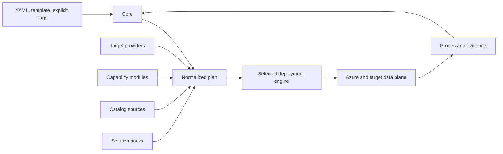

# Azure Data Lab Toolkit Architecture

This document records the committed architecture for Azure Data Lab Toolkit. It
defines implementation contracts; it does not claim that those contracts are
already implemented.

## Repository status

The repository currently contains a scaffold, documentation, and a backlog. It
does not contain deployable cmdlets and is not production ready. The predecessor,
Azure SQLVM Toolkit, is also unfinished. Azure Data Lab Toolkit starts with a new
architecture so the first SQL VM implementation does not block later targets.

The documentation uses these terms deliberately:

| Status | Meaning |
| --- | --- |
| Current | Verified repository or released behavior |
| Committed design | An accepted implementation contract that is not necessarily built |
| Backlog | Intended work whose detailed contract is not yet accepted |
| Exploratory | Research or an unresolved design question |
| Deferred | Work intentionally postponed |
| Rejected or superseded | A decision retained only for history |

## Accepted system shape



The extension types are separate:

- **Core** owns configuration, policy, planning, approvals, orchestration, state,
  reports, and lifecycle rules.
- **Target providers** describe one deployable target, beginning with SQL Server
  on Azure VM.
- **Capability modules** contribute reusable concerns such as networking,
  storage, identity, Git integration, or cost guardrails.
- **Catalog sources** resolve governed software, data, and private artifacts.
- **Solution packs** compose providers, modules, catalog entries, and probes into
  a scenario without becoming a deployment engine.
- **Probes** verify declared postconditions and emit evidence.
- **Deployment engines** translate and apply an approved normalized plan.

Providers do not implement `ExportBicep` or `ExportTerraform`. Export and apply
belong to deployment engines.

## Target order

The committed delivery order is:

1. SQL Server on Azure VM
2. Azure SQL Database
3. Azure SQL Managed Instance
4. Microsoft Fabric

Managed PostgreSQL and the other targets described in the project roadmap follow
later. SQL Server or PostgreSQL on Linux VMs and containers are deferred.
Kubernetes is deferred. Fabric infrastructure-as-code completeness remains
exploratory.

## Core contracts

YAML is the canonical durable input. Configuration precedence is:

```text
schema defaults < selected template < YAML < explicit flags
```

Every resolved value records its source and derivation. The core produces a
versioned normalized plan with:

- stable resource and action IDs;
- directed acyclic graph dependencies;
- canonical serialization and plan hash;
- Key Vault or other secret references, never secret values;
- resource ownership and teardown intent;
- preconditions, postconditions, risks, and provenance;
- toolkit, schema, provider, engine, and catalog versions;
- explicit unsupported-capability failures.

`-Plan` is deterministic and offline. It does not require Azure authentication,
query Azure, or mutate anything. Facts that cannot be established offline are
marked `unverified`.

`-WhatIf` requires Azure authentication. It reconciles an immutable plan with
live state and reports `create`, `reuse`, `update`, `replace`, `conflict`, and
`drift`. It never mutates resources. Engine-native preview output may supplement
this evidence but cannot redefine toolkit `-WhatIf` semantics.

Cost estimation is a separate operation. Assessment is distinct from migration.
Reports use a versioned evidence envelope and may be rendered as console, JSON,
Markdown, or HTML without changing their meaning.

## State and ownership

The default state backend is local. Each run has an immutable run ID, an
append-only event log, and periodic snapshots. State contains references and
evidence, not secrets. A per-run lock prevents concurrent mutation. Resume first
reconciles recorded and live state, then continues only idempotent or explicitly
approved actions.

Resources are classified as:

- `owned`: created by this run and eligible for confirmed teardown;
- `adopted`: existing and explicitly placed under toolkit lifecycle control;
- `reused`: existing and used without lifecycle ownership;
- `external`: observed or referenced only.

Unknown resources are never deleted. Deletion requires both eligible ownership
and an approved teardown intent in the plan.

## Engine direction

PowerShell is the first engine. Bicep and Terraform follow after the plan and
provider contracts are stable. Each is an explicit engine choice and may export
artifacts and apply them through toolkit orchestration. Engine-native state and
toolkit run state remain separate and linked by stable IDs.

## Lifecycle

```text
resolve -> validate -> assess -> plan -> what-if -> estimate cost
        -> approve -> deploy -> probe -> report
        -> shutdown/resume -> teardown preview -> approve teardown
        -> teardown -> cleanup proof
```

Only applicable stages run, but no engine may bypass approval, spend, secret,
sensitive-data, licensing, or teardown controls. Authenticated webhooks, CI jobs,
or AI-assisted sessions may request non-mutating work or resume an approved run
using its run ID and an idempotency key. They cannot grant approval or weaken
policy.

## Decision index

The publishable documentation expands these contracts:

- [Architecture overview](../docs-site/src/content/docs/architecture.mdx)
- [System context](../docs-site/src/content/docs/architecture/system-context.mdx)
- [Core](../docs-site/src/content/docs/architecture/core.mdx)
- [Plan and state](../docs-site/src/content/docs/architecture/plan-and-state.mdx)
- [Extension model](../docs-site/src/content/docs/architecture/extension-model.mdx)
- [Providers](../docs-site/src/content/docs/architecture/providers.mdx)
- [Deployment engines](../docs-site/src/content/docs/architecture/engines.mdx)
- [Provider lifecycle](../docs-site/src/content/docs/architecture/provider-lifecycle.mdx)
- [Architecture decisions](../docs-site/src/content/docs/architecture/decisions.mdx)
