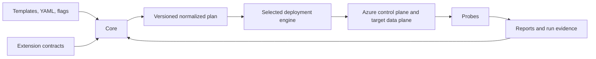
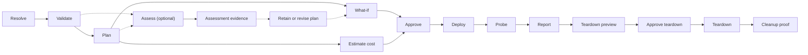

Current document; committed design

Azure Data Lab Toolkit is being designed before its first deployable cmdlet is
built. The repository currently contains a scaffold, documentation, and a
backlog. This chapter describes **committed design**, not shipped functionality.

The predecessor, Azure SQLVM Toolkit, is unfinished. The new architecture starts
with SQL Server on Azure VM while leaving deliberate extension points for the
broader data-lab roadmap.

## Read status precisely

| Label | Meaning |
| --- | --- |
| **Current** | Verified repository or released behavior |
| **Committed design** | Accepted contract, not necessarily implemented |
| **Backlog** | Intended work without a settled detailed contract |
| **Exploratory** | Research or an unresolved design question |
| **Deferred** | Explicitly postponed |
| **Rejected or superseded** | Preserved only as decision history |

## System shape

| Part | Owns | Does not own |
| --- | --- | --- |
| [Core](./core/) | Resolution, policy, plans, approvals, orchestration, state, reports | Target or engine implementation |
| [Target providers](./providers/) | Target capabilities, constraints, resources, target-specific validation | Export formats, orchestration, global state |
| [Other extensions](./extension-model/) | Reusable capabilities, catalogs, solution packs, and probes | A competing plan or state model |
| [Deployment engines](./engines/) | Exporting and applying an approved plan | Target business rules or policy overrides |

## Fixed design rules

- YAML is the canonical, source-controllable input.
- Precedence is `schema defaults < template < YAML < explicit flags`.
- Every resolved value carries provenance.
- `-Plan` is deterministic, offline, unauthenticated, and non-mutating.
- `-WhatIf` is Azure-aware, authenticated, and non-mutating.
- PowerShell is first; Bicep and Terraform follow as explicit engine choices.
- Assessment, cost estimation, deployment, migration, and teardown are distinct
  operations.
- Every target and solution pack emits an explicit `secretStoreDecision`.
- Every Azure VM emits an `administrativeAccessDecision`; Bastion with no public
  IP is the default.
- Secrets are referenced, never embedded in plans, state, or reports.
- Unknown resources are never deleted.
- Local and CI execution use the same plan, evidence, and approval contracts,
  while unattended mutation requires remotely coordinated state.

The detailed [plan and state contract](./plan-and-state/) makes these
rules testable.

## Delivery order

The [authoritative segment plan](../roadmap/) moves from the offline Core and
repository CI into a four-step SQL VM proof, then Azure SQL Database and SQL
Managed Instance. Managed PostgreSQL, PostgreSQL on Azure VM, and containerized
PostgreSQL follow before Bicep, Terraform, and the general Git and CI/CD
adapters. Fabric delivery begins after those segments. Databricks, later data
providers, SQL Server on Linux or containers, and Kubernetes follow.

That order controls focus, not technical coupling. Terraform does not depend
technically on Bicep. Fabric workspace creation does not depend on Git.
PostgreSQL does not depend on Fabric. Fabric infrastructure-as-code completeness
remains exploratory even though the two infrastructure engines are delivered
earlier.

## Lifecycle

Stages run only when applicable. [Provider lifecycle](./provider-lifecycle/)
defines contribution boundaries; the core remains the lifecycle coordinator.
Assessment may branch before or after Plan. If its evidence changes intended
actions, Core creates a newly hashed plan before WhatIf or approval.

## Trust and evidence

The architecture treats the workstation or CI runner, artifact sources, Azure
control plane, secret store, target guest or data plane, and local or remote
report/state store as separate trust zones. See
[System Context](./system-context/) for the data flows and
[Security](../security/) for project guidance.

Every operation emits a versioned evidence envelope. Console, JSON, Markdown,
and HTML are renderings of the same underlying record, not independent truths.
The design does not imply that these outputs have been implemented.

The accepted decisions and remaining research boundaries are collected in
[Architecture Decisions](./decisions/).
