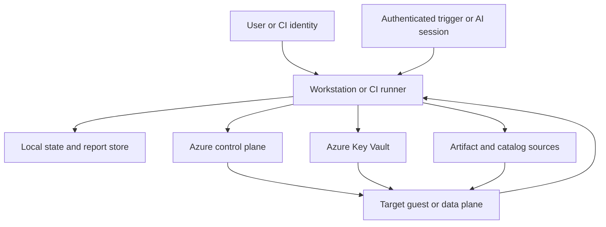

Committed design

Azure Data Lab Toolkit runs from a trusted workstation or CI runner and
coordinates Azure control-plane and target data-plane operations. It treats each
external boundary as untrusted until identity, integrity, policy, and evidence
requirements are satisfied.

## Context

| Trust zone | Holds | Required controls |
| --- | --- | --- |
| Workstation or CI runner | Configuration, code, transient credentials, orchestration process | Trusted toolkit version, least privilege, protected working directory, dependency verification |
| Artifact and catalog sources | Sample data, software, scripts, metadata | HTTPS, provenance, license, version, checksum or signature where available, content policy |
| Azure control plane | Resource Manager and service management APIs | Entra identity, least-privilege RBAC, authenticated live queries, correlation IDs |
| Azure Key Vault | Secret values, keys, and certificates | Secret references in plans, managed identity where possible, no report or state copies |
| Target guest or data plane | VM guest, SQL endpoint, Fabric item, storage endpoint, future targets | Target-specific identity, network isolation, scoped commands, postcondition probes |
| State and report store | Plans, events, snapshots, approvals, evidence | Access control, integrity hashes, retention policy, no secrets, redaction |

Crossing a boundary produces structured evidence. Sensitive values are redacted
at source rather than removed later from logs.

## Identities

Human, CI, deployment-engine, target-runtime, and probe identities are distinct
even if an early local implementation uses the same signed-in principal for
several roles.

- **Human identity** requests operations and grants approvals.
- **CI identity** uses short-lived federation and only its workflow scope.
- **Engine identity** applies the approved plan with least-privilege Azure roles.
- **Runtime identity** lets deployed resources access Key Vault or storage
  without copied credentials where supported.
- **Probe identity** receives read-only access unless a probe explicitly requires
  a reversible test action.

The evidence envelope records the acting identity as a stable subject identifier,
not a reusable credential.

## Artifact flow

Catalog metadata is resolved during planning. Downloads and execution occur only
after integrity, licensing, sensitivity, and approval policy has been evaluated.
A private URL or local path is not implicitly trusted.

The acquisition record includes source, publisher, version, retrieval time,
integrity result, license decision, sensitivity label, and the action that will
consume the artifact. Mutable URLs without a trusted checksum are marked
unverified and may be denied by policy.

See [Community Tools](../../community/tools/),
[Data Sources](../../community/data-sources/), [Licensing](../../licensing/), and
[Security](../../security/) for reader guidance.

## Remote and assisted execution

Webhooks, schedules, CI jobs, and AI-assisted sessions are requesters, not policy
authorities. An authenticated trigger may:

- request validation, `-Plan`, reporting, or another non-mutating operation;
- resume an approved run using its immutable run ID and a unique idempotency key.

It cannot:

- approve its own plan or teardown;
- widen resource scope or increase the approved spend boundary;
- opt in to secret display or weaker secret handling;
- acknowledge sensitive data or accept a license;
- adopt or delete existing resources;
- skip reconciliation, probes, or cleanup evidence required by policy.

Expired approval, changed plan hash, missing lock, changed identity scope, drift,
or conflict stops continuation and requires human review.

## Network stance

Providers and capability modules propose target-specific networking, but core
policy decides whether a proposal is allowed. Private access, Azure Bastion, and
managed identity are preferred where the target supports them. A public endpoint
or broad firewall rule must be visible in the plan, risk record, cost estimate,
and approval evidence.

This architecture defines the control points. It does not claim that a complete
threat model or production security baseline is implemented today.
